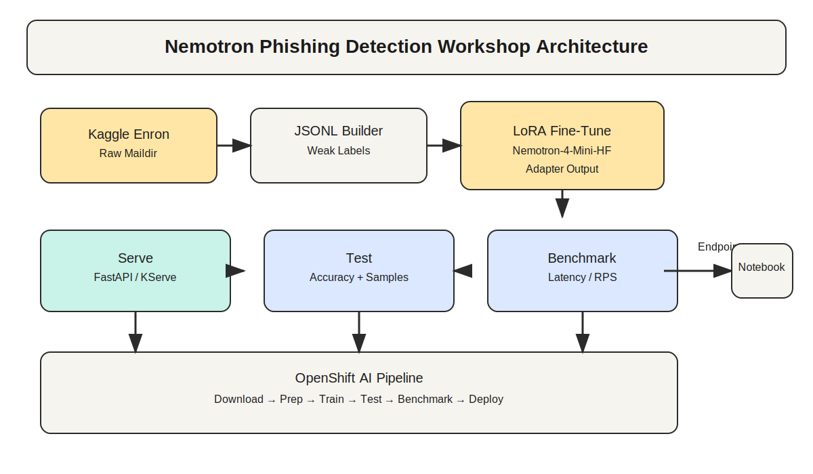

# Nemotron Phishing Detection Workshop

This workshop walks you through fine-tuning a Nemotron model on the Enron email dataset for phishing detection, serving the model, testing it, and benchmarking it. It also includes a Kubeflow/ OpenShift AI pipeline definition and a notebook for calling a deployed endpoint.

## Architecture


## Prerequisites
- Python 3.10+
- NVIDIA L4 GPU instance with CUDA drivers
- Kaggle API token for dataset download

## Quickstart (local)
1. Install dependencies:
   ```bash
   # Install a CUDA-enabled PyTorch build if needed, then:
   pip install -r requirements.txt
   ```
   If your environment does not already have CUDA-enabled PyTorch, install it first. Example for CUDA 12.1:
   ```bash
   pip install torch --index-url https://download.pytorch.org/whl/cu121
   ```
2. Set Kaggle credentials:
   ```bash
   export KAGGLE_USERNAME="your_username"
   export KAGGLE_KEY="your_key"
   ```
3. Run the full workflow:
   ```bash
   bash scripts/run_training.sh
   ```
4. Serve the model locally:
   ```bash
   python scripts/serve.py --model_name nvidia/Nemotron-4-Mini-HF --adapter_dir outputs/adapter
   ```
5. Test the model:
   ```bash
   python scripts/test_model.py --endpoint http://127.0.0.1:8000/predict
   ```
6. Benchmark the model:
   ```bash
   python scripts/benchmark_model.py --endpoint http://127.0.0.1:8000/predict
   ```

## Workshop Notebooks
- `notebooks/01_workshop_fine_tune.ipynb`: end-to-end fine-tuning walkthrough
- `notebooks/02_openshift_ai_infer.ipynb`: call an OpenShift AI endpoint

## Data Notes
The Enron dataset is not labeled for phishing. This workshop uses a simple keyword heuristic to generate a weak label for phishing vs benign. Replace the heuristic or inject your own labels if you need higher fidelity.

## OpenShift AI Pipeline
The pipeline definition is in `pipelines/openshift_ai_pipeline.py`. It assumes you build a container image with this repository and pass the image to the pipeline. See the header comment in that file for usage.
To compile the pipeline YAML locally:
```bash
python pipelines/compile_pipeline.py --output nemotron_pipeline.yaml
```

## License / Data Terms
The Enron email dataset is sourced from Kaggle: https://www.kaggle.com/datasets/wcukierski/enron-email-dataset. Follow Kaggle's terms and license conditions.
# fine-tuning-workshop
